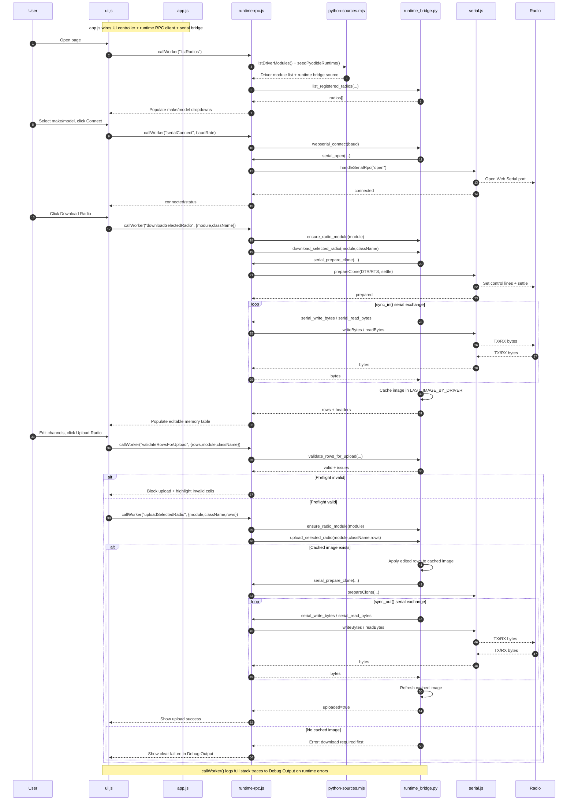

# webchirp 📻

Prototype for running parts of [CHIRP](https://github.com/kk7ds/chirp) in the browser with a CHIRP-like UI.

Formed from [github.com/jasiek/webchirp](https://github.com/jasiek/webchirp) with additional features and improvments.

# This is live and running on [lanrat.github.io/webchirp](https://lanrat.github.io/webchirp/)


## What is implemented

- `chirp` is included as a git submodule at `/Users/jps/github/webchirp/chirp`
- Browser UI with a channel-memory table inspired by CHIRP
- Python runtime in-browser (Pyodide) running CHIRP code (`generic_csv` driver)
- CSV import/parse via CHIRP Python code
- CSV export/normalization via CHIRP Python code
- Web Serial bridge (browser serial in JS, called from Python in Pyodide)
- Python-driven TX/RX serial transaction path (`serialConnect`, `serialTxRx`)
- Radio make/model dropdowns populated from CHIRP driver source files
- Selection-aware download/upload actions using selected CHIRP clone-mode driver

## Run the prototype

From `/Users/jps/github/webchirp`:

```bash
npm run dev
```

Open [http://127.0.0.1:8000/](http://127.0.0.1:8000/).

Serial access requires a browser with Web Serial support and a secure context
(`http://localhost` works).

There are two connect buttons:

- **Connect** uses native Web Serial when available, otherwise WebUSB.
- **Connect via WebUSB** forces the WebUSB path. Use this when native Web Serial
  exists but cannot drive your adapter — notably Chrome on Android, which now
  exposes `navigator.serial` but only supports a limited set of devices (not
  FTDI/PL2303-class USB UART chips). There is no way to detect this in advance,
  hence the explicit button.

Over WebUSB a single device chooser is shown and the selected adapter is
dispatched to a chip-specific driver:

- **FTDI** adapters (FT231X, FT232R, ...) use a built-in FTDI-over-WebUSB
  driver, verified end-to-end on Android Chrome with an FT231X cable and a
  Baofeng UV-5R.
- **Prolific PL2303** adapters use a built-in PL2303-over-WebUSB driver that
  detects the chip generation (01/HX/TA/TB and the newer HXN family:
  GC/GB/GT/GL/GE/GS) and applies the matching init and register map. Also
  verified end-to-end on Android Chrome.
- **USB CDC-ACM** devices are dispatched to Google's `web-serial-polyfill`.
  This path is wired up but untested — most radio programming cables are not
  CDC-ACM.
- Other vendor-specific UART bridges (CH340, CP2102) are **not supported**
  over WebUSB; they need chip-specific drivers that have not been written yet
  (see `web/js/ftdi-webusb.js` and `web/js/pl2303-webusb.js` for the pattern)
  and still require native Web Serial on desktop.

`npm run dev` serves with cross-origin isolation headers (`COOP`/`COEP`) so
Pyodide synchronous JS bridging can use `SharedArrayBuffer` without warnings.

For radio cloning:

1. Choose `Radio make` and `Radio model` from dropdowns (loaded from CHIRP sources).
2. Click `Connect` (baud is prefilled when available from selected driver).
3. Click `Download Radio` to read channels into the table.
4. Edit values and click `Upload Radio` to write back.

## Command-line codeplug read/write

You can read or write a real-radio codeplug from the command line using the same
runtime bridge (`web/python/runtime_bridge.py`) and local CHIRP source loading
path used by the Node tests. This is the intended agent-facing CLI for scripted
radio access.

From `/Users/jps/github/webchirp`:

```bash
npm run radio:read -- --port /dev/ttyUSB0 --module uv5r --class BaofengUV5R --format json --output /tmp/uv5r.json
npm run radio:write -- --port /dev/ttyUSB0 --module uv5r --class BaofengUV5R --format json --input /tmp/uv5r.json
```

Optional flags:

- `--baud 9600` to override the driver's default baud.
- `--chirp-dir /path/to/chirp` (or `WEBCHIRP_CHIRP_DIR=/path/to/chirp`) to load CHIRP sources from a custom directory.
- `--serial-timeout-s 2.0` to override serial read timeout used by the runtime bridge.

Supported formats:

- `--format json`: read/write a JSON object containing `rows`, `headers`, `csvText`, `settings`, and binary `imageBase64`.
- `--format csv`: read/write CHIRP-normalized CSV text.
- `--format img`: read/write CHIRP `.img` clone files.

The flow is:
1. Open serial on the selected port.
2. `radio:read` runs `download_selected_radio(module, class)` and caches the clone image in runtime before writing the requested output format.
3. `radio:write` reads JSON/CSV/IMG input and uploads it through `upload_selected_radio(...)`; `.img` input is first loaded through CHIRP image detection so the cached image and selected driver stay aligned.
4. Disconnect serial.

## Hardware E2E CLI test (read then write same codeplug)

The older live smoke test still exists:

```bash
npm run test:hw -- --port /dev/ttyUSB0 --module uv5r --class BaofengUV5R
```

Use `radio:read` / `radio:write` for deterministic agent workflows and
format-specific codeplug files.

## Architecture

- Frontend: `/Users/jps/github/webchirp/web/index.html` + `/Users/jps/github/webchirp/web/app.js`
- Main-thread runtime bridge: `/Users/jps/github/webchirp/web/js/runtime-rpc.js`
- Python source providers: `/Users/jps/github/webchirp/web/js/python-sources.mjs`
- Versioned Python runtime code: `/Users/jps/github/webchirp/web/python/runtime_bridge.py`
- Browser runtime loads CHIRP source files into Pyodide from jsDelivr (revision-pinned).
- Command-line runtime can load CHIRP source files from a local directory:
  - `WEBCHIRP_CHIRP_DIR=/path/to/chirp npm run test:channels`
- Core CHIRP files preloaded into Pyodide include:
  - `/chirp/chirp/__init__.py`
  - `/chirp/chirp/chirp_common.py`
  - `/chirp/chirp/directory.py`
  - `/chirp/chirp/drivers/generic_csv.py`
  - and required dependencies (`errors.py`, `util.py`, `memmap.py`)

## Important scope note

This MVP proves in-browser execution of CHIRP Python logic for file-backed workflows.

Live browser serial now attempts to execute the selected CHIRP clone-mode
driver (`sync_in`/`sync_out`) through a generalized pyserial-like bridge.
Compatibility still depends on driver expectations and browser transport limits.

## Sequence diagram (sketch) of how it all works


